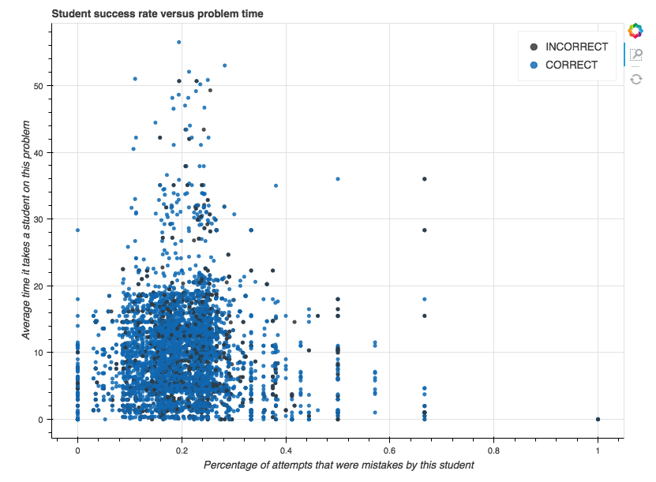

# Making predictions from a DataShop dataset
<a style="margin:30px" href="https://www.featuretools.com">
    
</a>

In this tutorial, we show how to predict whether a student will succesfully answer a problem using a dataset from [CMU DataShop](https://pslcdatashop.web.cmu.edu/). The workflow shown here can be used to quickly **organize** and **make predictions** about any DataShop dataset.

*If you're running the [notebook](Demo%20-%20DataShop.ipynb) yourself, please download the [geometry dataset](https://pslcdatashop.web.cmu.edu/DatasetInfo?datasetId=76) into the `data` folder in this repository. You will only need the `.txt` file. The infrastructure in that notebook will work with **any** DataShop dataset, but you will need to change the filename to the dataset you'd like to load.

## Highlights
* Show how to import a DataShop dataset into featuretools
* Show how to make custom primitives for stacking
* Show efficacy of automatic feature generation with these datasets

## Demonstration

The main notebook can be found [here](Demo%20-%20DataShop.ipynb). 



To run the notebook, you will need to download Featuretools with
```
pip install featuretools
```
and the geometry dataset from [the datashop website](https://pslcdatashop.web.cmu.edu/DatasetInfo?datasetId=76) (free account required). Take the `.txt` file from the zipped download and place it in the `data` folder in this repository. The notebook relies on a `datashop_to_entityset` function which is described in depth in the [entityset_function notebook](entityset_function.ipynb). 

## Feature Labs
<a href="https://www.featurelabs.com/">
    
</a>

Featuretools was created by the developers at [Feature Labs](https://www.featurelabs.com/). If building impactful data science pipelines is important to you or your business, please [get in touch](https://www.featurelabs.com/contact.html).
